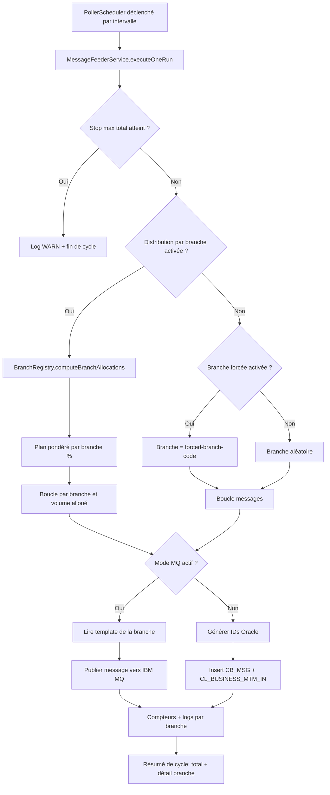
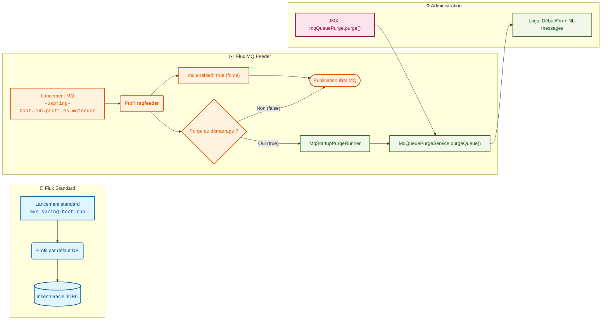
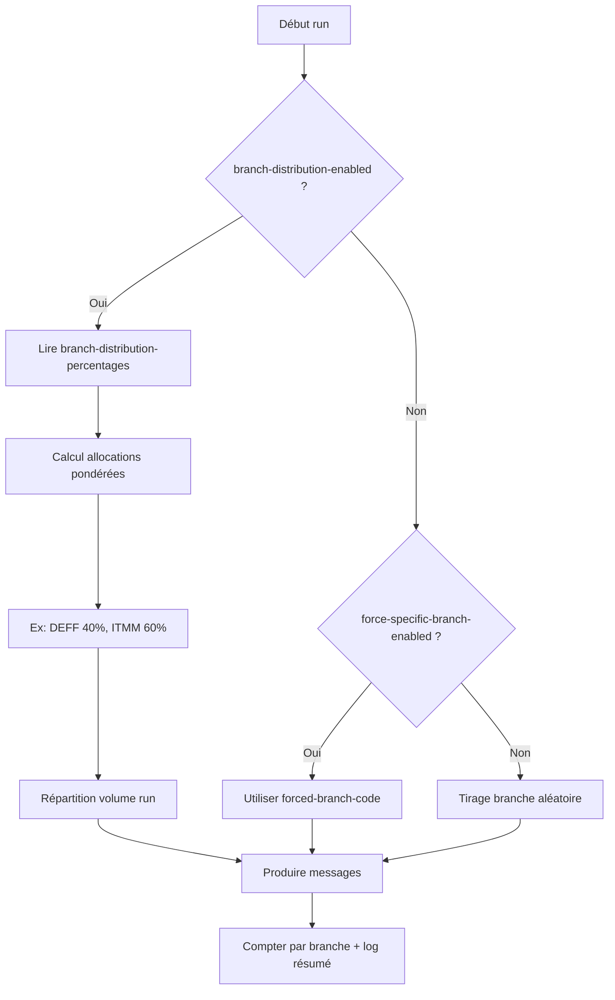

# CB MSG Feeder (Spring Boot + JDBC/MQ, Java 17)

## Objectif

Application Spring Boot qui exécute un poller configurable et alimente:
- `ACETP.CB_MSG`
- `ACETP.CL_BUSINESS_MTM_IN`
- ou une queue IBM MQ (profil `mqfeeder`)

À chaque cycle:
1. Calculer le volume de messages (fixe `N` ou aléatoire `1..N` selon la conf).
2. Choisir la branche: aléatoire (par défaut) ou branche forcée par code si activée.
3. Insérer ce volume dans `CB_MSG` avec les champs obligatoires.
4. Insérer le même volume dans `CL_BUSINESS_MTM_IN` avec la référence `CB_MSG_DB_ID`.
5. Renseigner explicitement les dates en DateTime (`CREATION_DATE`, `UPDATING_DATE` dans `CB_MSG`, et `CREATION_DATE` dans `CL_BUSINESS_MTM_IN`).


## Diagrammes d'architecture et de workflow

### 1) Workflow global du poller



### 2) Modes de lancement et interactions MQ/JMX


```

### 3) Stratégie de sélection de branche



## Stack technique

- Java 17
- Spring Boot
- Spring JDBC
- Oracle JDBC (`ojdbc11`)
- Pas de Spring Test

## Configuration Oracle (application.yml)

La base est configurable via `src/main/resources/application.yml` (ou variables d’environnement):

```yaml
server:
  port: 8082

spring:
  datasource:
    url: ${DB_URL:jdbc:oracle:thin:@//localhost:1521/FREEPDB1}
    username: ${DB_USERNAME:ACETP}
    password: ${DB_PASSWORD:Aissa1000*}
    driver-class-name: ${DB_DRIVER:oracle.jdbc.OracleDriver}

app:
  feeder:
    poll-interval-ms: ${FEEDER_POLL_INTERVAL_MS:10000}
    max-messages-per-run: ${FEEDER_MAX_MESSAGES_PER_RUN:1000}
    fixed-limit: ${FEEDER_FIXED_LIMIT:true}
    force-specific-branch-enabled: ${FEEDER_FORCE_SPECIFIC_BRANCH_ENABLED:false}
    forced-branch-code: ${FEEDER_FORCED_BRANCH_CODE:}
    stop-on-max-total-messages-enabled: ${FEEDER_STOP_ON_MAX_TOTAL_MESSAGES_ENABLED:false}
    max-total-messages: ${FEEDER_MAX_TOTAL_MESSAGES:100000}
    branch-distribution-enabled: ${FEEDER_BRANCH_DISTRIBUTION_ENABLED:false}
    branch-distribution-percentages:
      DEFF: ${FEEDER_BRANCH_PCT_DEFF:0}
      ITMM: ${FEEDER_BRANCH_PCT_ITMM:100}
      PLPX: ${FEEDER_BRANCH_PCT_PLPX:0}
      HUHX: ${FEEDER_BRANCH_PCT_HUHX:0}
      SGSG: ${FEEDER_BRANCH_PCT_SGSG:0}
      HKHH: ${FEEDER_BRANCH_PCT_HKHH:0}
      CHZZ: ${FEEDER_BRANCH_PCT_CHZZ:0}
      AU2S: ${FEEDER_BRANCH_PCT_AU2S:0}
      ESMX: ${FEEDER_BRANCH_PCT_ESMX:0}
      GRAX: ${FEEDER_BRANCH_PCT_GRAX:0}
      GGS1: ${FEEDER_BRANCH_PCT_GGS1:0}
      LULL: ${FEEDER_BRANCH_PCT_LULL:0}
      BEBZ: ${FEEDER_BRANCH_PCT_BEBZ:0}
      JESH: ${FEEDER_BRANCH_PCT_JESH:0}
      GB2L: ${FEEDER_BRANCH_PCT_GB2L:0}
      FRPP: ${FEEDER_BRANCH_PCT_FRPP:0}
    cb-msg-sequence-name: ${FEEDER_CB_MSG_SEQ:ACETP.BDOMO_GRM_TRD_CB_MSGS_DB_ID_Test}
    cl-business-file-sequence-name: ${FEEDER_CL_FILE_SEQ:ACETP.SEQ_CL_BUSINESS_FILE_ID}
```

### Forcer une branche spécifique

- `app.feeder.force-specific-branch-enabled=true` active la branche forcée.
- `app.feeder.forced-branch-code=<CODE>` définit le code branche (ex: `ITMM`, `FRPP`, `DEFF`, `GRAX`, ...).
- Si le flag est `false`, la branche reste aléatoire via le registre en mémoire.


### Distribution par branche (graphe en mémoire)

- `app.feeder.branch-distribution-enabled=true` active la répartition par pourcentage.
- `app.feeder.branch-distribution-percentages` contient le graphe `{branchCode -> pourcentage}` chargé en mémoire au démarrage.
- Chaque branche doit avoir une valeur entre `0` et `100`.
- `0` => branche ignorée.
- Le calcul est fait à chaque poll **sur la base de** `max-messages-per-run` (mode distribution), puis les lignes sont réparties par branche selon les pourcentages.

Exemple:
- `ITMM=60`, `DEFF=40`, autres `0` => sur `max-messages-per-run=1000`, cible ≈ `600` ITMM et `400` DEFF.

## Scripts SQL manuels (sans composant Java)

Les tables existent déjà en base dans votre contexte. Les scripts restent fournis pour alignement/rejeu manuel si nécessaire.

Les scripts SQL sont fournis séparément pour exécution manuelle:

- `src/main/resources/sql/ddl-feeder.sql`
  - crée les séquences Oracle utilisées par l'application (`ACETP.BDOMO_GRM_TRD_CB_MSGS_DB_ID_Test`, `ACETP.SEQ_CL_BUSINESS_FILE_ID`)
  - crée `ACETP.CB_MSG`
  - crée `ACETP.CL_BUSINESS_MTM_IN`
  - crée les index alignés au DDL fourni
- `src/main/resources/sql/truncate-feeder.sql`
  - purge les 2 tables via `TRUNCATE TABLE`
- `src/main/resources/sql/drop-feeder.sql`
  - supprime les 2 tables (`DROP ... CASCADE CONSTRAINTS PURGE`)
  - supprime aussi les 2 séquences feeder (`DROP SEQUENCE`)

Exemple d'ordre manuel:
1. `drop-feeder.sql`
2. `ddl-feeder.sql`
3. (optionnel) `truncate-feeder.sql` pour vider les tables


### Limite max totale d'insertion

- `app.feeder.stop-on-max-total-messages-enabled=true` active une limite cumulée sur tout le runtime.
- `app.feeder.max-total-messages` définit le plafond de lignes à insérer.
- Une fois le plafond atteint, l'insertion s'arrête et un log `WARN` est émis.

### Logs d'insertion

À chaque cycle, les logs affichent:
- le mode de branche (`RANDOM` ou `FORCED`) et le code forcé éventuel,
- l'état `branchDistributionEnabled` et le graphe chargé en mémoire (si activé),
- le nombre de lignes insérées dans le run + le cumul runtime,
- le détail des lignes insérées par flow/branche (`branchCode|branchName`).

## Lancement

```bash
mvn spring-boot:run

# Mode MQ
mvn spring-boot:run -Dspring-boot.run.profiles=mqfeeder
```

## Profil `mqfeeder` (IBM MQ, sans TLS)

- Le profil `mqfeeder` force automatiquement `app.feeder.mq.enabled=true`.
- Les templates sont configurés par branche dans `app.feeder.mq.branch-templates`.
- La queue cible est définie via `app.feeder.mq.queue-name` (défaut: `H73197_ATP.EXP.02.E`).
- `app.feeder.mq.purge-on-startup-enabled=true` permet de purger automatiquement la queue au démarrage (même logique que `mqQueuePurge.purge()`).
- La connexion IBM MQ est configurée dans `application-mqfeeder.yml` via `ibm.mq.*` avec défauts alignés: `queue-manager=QM1`, `channel=CLIATP01.FRATP01T.T1`, `ccsid=819`.

- Cas spécial supporté: en `mqfeeder`, si `app.feeder.mq.purge-on-startup-enabled=true` et `app.feeder.max-messages-per-run=0`, l'application exécute le purge au démarrage puis s'arrête proprement (mode purge-only).

## Purge JMX de la queue MQ

Un endpoint Actuator JMX est exposé en profil `mqfeeder`:

- `mqQueuePurge.purge()`

Cet endpoint consomme les messages de la queue configurée (`app.feeder.mq.queue-name`) jusqu'à épuisement, puis retourne le nombre de messages purgés.

Des logs explicites sont émis pour chaque purge (début/fin, queue ciblée, nombre de messages purgés), y compris lors du purge automatique au démarrage.

## Séquences Oracle et application.yml

Les noms de séquences sont configurés dans `application.yml`:
- `app.feeder.cb-msg-sequence-name`
- `app.feeder.cl-business-file-sequence-name`

L'application **ne crée pas automatiquement** ces séquences. Elle fait uniquement un `SELECT <sequence>.NEXTVAL FROM DUAL` au moment des insertions.

Donc, avant de lancer l'application, il faut exécuter le DDL (`ddl-feeder.sql`) pour créer les séquences par défaut.

Si vous changez les noms dans `application.yml`, vous devez aussi créer ces nouvelles séquences côté Oracle (ou adapter le script SQL).
